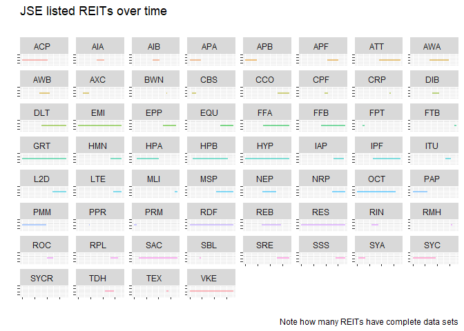
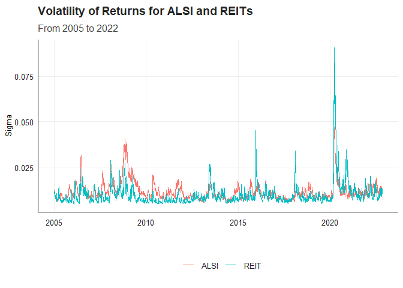
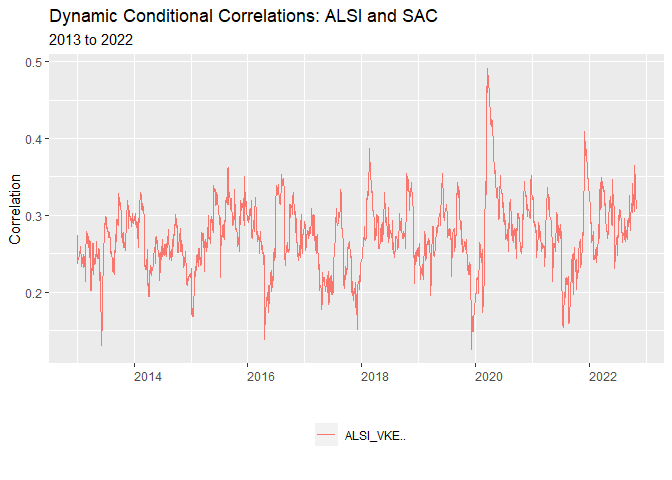
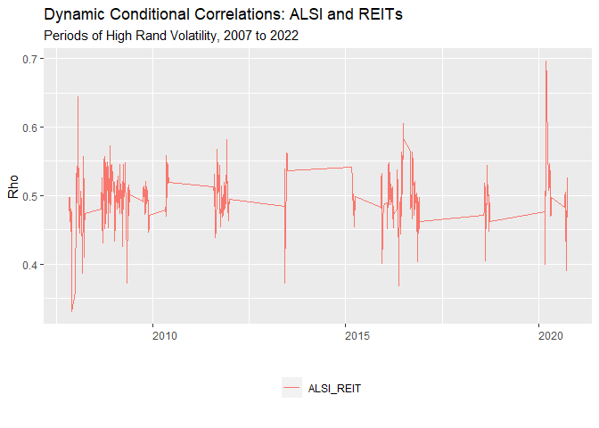

# Time-varying Correlation of South African Property Stocks and the JSE All Share Weighted Index

# Setting up

I begin my project by cleaning my environment and loading the necessary
functions to be used in order to

I make use of the ‘Texevier’ package to create the project

    Texevier::create_template(
        directory = "C:/Masters Economics/Fin Metrics/Fin_Metrics_Project",
                template_name = "Fin_Metrics_Project", build_project = TRUE, open_project = FALSE)

I then load the packages to used in this analysis. I make use of the
‘tidyverse’ to clean and wrangle the data as well as perform
visualization.

    # load pacakges to be used in the analysis
    pacman::p_load("tidyverse", "devtools", "rugarch", "rmgarch", 
        "forecast", "tbl2xts", "lubridate", "PerformanceAnalytics", 
        "ggthemes", "ks", "MTS", "robustbase", "tbl2xts")

# Import the data

I read in the Alsi\_Returns data and remove the words ‘SJ’ and ‘Equity’
from Tickers column to neaten up the data. Next, I view that data noting
the characteristics of the data such a date range and the various
columns of information.

I do notice that there are Tickers with missing values and some that
have not been included in the ALSI as they have zero weights.

I log the data before performing imputing the missing values in the data
set as I anticipate that it will result in NA/NaN/-Inf. The
‘impute\_missing\_values’ function can address Nas and Nan, so I will
set Returns with -Inf to zero.

Next, I source in all the functions to be used to conduct the analysis.

## Data Insights

I make use of the dplyr package to determine how many unique sectors are
in the data set and to determine how many unique property stocks or
REITS are included in the data set and if they change over time, by
arbitrarily entering dates within the data’s range.

If find that from 2005 to 2022, the number of REITS changes over time.
My next step is therefore to plot the data where each property ticker is
plotted in it’s own panel. To do this I make use of ‘facet\_wrap’ in the
package ‘ggplot2’

    # determine which sectors are included in the data set
    data_ALSI_returns %>% 
        select(Sector) %>%
        unique()

    # input any date with in the data range to determine how many unique property stocks there are and if this changes over time
    data_ALSI_returns %>% filter(date == "2013-02-03") %>%
        filter(Sector == "Property") %>%
        arrange(date, Tickers) %>% 
        group_by(Tickers) %>%
        select(date, Tickers) %>% 
        unique()

    # count the number of NAs or missing values in the data
    data_ALSI_returns %>% 
        select(date, Tickers, Return, J203) %>% 
        group_by(Tickers) %>%
        select(date, Tickers) %>% 
        unique()
        
    # some wrangling to determine if the J203 sums to 1 for an arbitrary date
    # can set date to any week date
    # there for can make use of na.omit or set NAs to zero for the weights column 'J203'
    # Which is tested below
    data_ALSI_returns %>% filter(date == "2012-02-03") %>% 
        select(date, Tickers, Return, J203, Sector) %>% 
        na.omit(J203) %>% 
        mutate(sum(J203)) 

I make use of the tidyverse package in to wrangle the data into a usable
format to conduct the analysis. The task here is to remove the property
stocks from the Alsi\_Returns data, so I can calculate the daily returns
for the ALSI less REITs. Once I have the daily weighted performance of
the AlSI less REITS I will combine these daily returns with the daily
returns data of the REITs. This is done so a comparison of individual
property stocks can be drawn with the ALSI equities.

Across time the number of REITs included in the index changes and there
are many instances of REITs moving in and out of the index.

One cannot impute missing values for the entire data set together,
especially given that the purpose of this study is to examine the
correlation of property stocks with rest of the ALSI. The approach I am
taking is to separate the property stocks from the rest of the ALSI as
discussed and then plot out the all the property stocks across time in
the data set and determine which have sufficiently complete returns
observations that I may impute accurate values that have a similar
distributions, so to capture the properties of these property stocks
(given that the theory surrounding REITs is that should be uncorrelated
to other equities. Once, I have determined which REITS to include I will
impute the missing for rest of the ALSI index and then combine the data
to begin the DCC or mGARCH model.

# Seperate and plot the REITs data

    library(tidyverse)

    # add individual property stock and their weighted returns to perform DCC
    graph_1_reit_funcs(df_data = df_data,
                    title = "JSE listed REITs over time ",
                    subtitle = "",
                    caption = "Note how many REITs have complete data sets",
                    xlabel = "",
                    ylabel = "")

From the graph above one can see that can see that there are only a few
listed REITs that have a sufficient number of observations to offer
insight into the correlation between between REITs and the rest of the
ALSI.

# Cumulative Returns over time

    graph_cum_return_func(df_data = data_ALSI_returns,
                          title = "Cumulative Returns of ALSI",
                          subtitle = "From 2005 to 2022",
                          caption = "REITS vs ALSI excl. REITS",
                          xlabel = "Date",
                          ylabel = "Percentage %")

I then proceed to select the following Tickers to include in the study.
REITs to include: CCO, GRT, HYP, RDF, RES, SAC, VKE.

Next, I filter the ALSI Property data for the REITs listed above and
impute the missing values in this filtered data.

I now want to bind the rows of the weighted returns of the ALSI with the
individual property stocks that had previously been removed separated to
impute the missing values. This will allow for correlation comparisons
with individual property stocks with the broader performance with the
ALSI equities for the other sectors.

The data wrangling described above is nested in the function
‘mv\_garch\_COMBINED\_nested\_function(df\_data)’ for the estimated
volatility.

# DCC Model multivariate GARCH model (Time varying correlation)

I follow the practical code closely to render the model. I amend code
and nested functions inside one another to keep the working document
neat. I plot the estimates of volatility for each seriesfrom ‘dccPre’.

I plot the volatility of JSE listed ALSI and REIT equities included in
this study.

    # volatility of REITs
    mv_garch_COMBINED_nested_function(Vol_ALSI_REIT)

The ‘dccPre’ function is use to fit the univariate GARCH models to each
series in the data and a standard univariate GARCH(1,1) is run which
produces the error term and sigma, which is then used to calculate the
standardized residuals used in estimate the DCC model.

The DCC model is then run and the estimates of time-varying correlation
are produced.

# CORR GRAPHS: Co-movements

The ‘dccPre’ function is use to fit the univariate GARCH models to each
series in the data and a standard univariate GARCH(1,1) is run which
produces the error term and sigma, which is then used to calculate the
standardized residuals used in estimate the DCC model.

The DCC model is then run and the estimates of time-varying correlation
are produced.

    graph_rename_func_mv(input_name_1 = "ALSI_",
                         input_name_2 = "_ALSI",
                         title = "Dynamic Conditional Correlations: JSE ALSI and REITS",
                         subtitle = "2005 to 2022",
                         caption = "",
                         xlabel = "",
                         ylabel = "Rho")

# INDIVIDUAL REITS

    graph_rename_func_mv(input_name_1 = "ALSI",
                         input_name_2 = "_ALSI",
                         title = "Dynamic Conditional Correlations: JSE ALSI and Individual REITS",
                         subtitle = "2013 to 2022",
                         caption = "",
                         xlabel = "",
                         ylabel = "Rho")

    graph_rename_func_mv(input_name_1 = "ALSI_GRT",
                         input_name_2 = "_ALSI",
                         title = "Dynamic Conditional Correlations: ALSI and GRT",
                         subtitle = "2013 to 2022",
                         caption = "",
                         xlabel = "",
                         ylabel = "Correlation")

    graph_rename_func_mv(input_name_1 = "ALSI_HYP",
                         input_name_2 = "_ALSI",
                         title = "Dynamic Conditional Correlations: ALSI and HYP",
                         subtitle = "2013 to 2022",
                         caption = "",
                         xlabel = "",
                         ylabel = "Correlation")

    graph_rename_func_mv(input_name_1 = "ALSI_RES",
                         input_name_2 = "_ALSI",
                         title = "Dynamic Conditional Correlations: ALSI and RES",
                         subtitle = "2013 to 2022",
                         caption = "",
                         xlabel = "",
                         ylabel = "Correlation")

    graph_rename_func_mv(input_name_1 = "ALSI_RDF",
                         input_name_2 = "_ALSI",
                         title = "Dynamic Conditional Correlations: ALSI and RDF",
                         subtitle = "2013 to 2022",
                         caption = "",
                         xlabel = "",
                         ylabel = "Correlation")

    graph_rename_func_mv(input_name_1 = "ALSI_SAC",
                         input_name_2 = "_ALSI",
                         title = "Dynamic Conditional Correlations: ALSI and SAC",
                         subtitle = "2013 to 2022",
                         caption = "",
                         xlabel = "",
                         ylabel = "Correlation")

    graph_rename_func_mv(input_name_1 = "ALSI_VKE",
                         input_name_2 = "_ALSI",
                         title = "Dynamic Conditional Correlations: ALSI and SAC",
                         subtitle = "2013 to 2022",
                         caption = "",
                         xlabel = "",
                         ylabel = "Correlation")

# CAPCO

    graph_rename_func_mv(input_name_1 = "ALSI",
                         input_name_2 = "_ALSI",
                         title = "Dynamic Conditional Correlations: ALSI, CCO and RDF",
                         subtitle = "2018 to 2022",
                         caption = "",
                         xlabel = "",
                         ylabel = "Rho")

    graph_rename_func_mv(input_name_1 = "CCO.._RDF",
                         input_name_2 = "_CCO",
                         title = "Dynamic Conditional Correlations: CCO and RDF",
                         subtitle = "2018 to 2022",
                         caption = "",
                         xlabel = "",
                         ylabel = "Rho")

# Periods of Rand Volatility

In this section, periods of high USD/ZAR (Dollar Rand) volatility are
isolated and used as to filter for the ALSI combined and imputed data.
The premise being that periods of high Rand volatility can act as an
indicator for high levels of volatility in South Africa financial
markets and other asset classes. These highly volatile periods are then
used as an index to filter the returns data for periods where South
African markets were volatile.

Given that the high volatility combine imputed ALSI returns data will
have large missing gaps due to periods of moderate or low volatility,
dynamic correlations between equity pairs will have to be charted for
short periods of a time. This is due to the fact that the graphing
function used will not skip whole year periods.

Following this methodology of running multiple DCC models on smaller
periods of high volatility decreases the run time of the model.

# HI VOL

    hi_vol_graph_rename_func_mv(input_name_1 = "ALSI_",
                                        input_name_2 = "_ALSI",
                                        title = "Dynamic Conditional Correlations: ALSI and REITs",
                                        subtitle = "Periods of High Rand Volatility, 2007 to 2022",
                                        caption = "",
                                        xlabel = "",
                                        ylabel = "Rho")

# LOW VOL

    Low_vol_graph_rename_func_mv(input_name_1 = "ALSI_",
                                        input_name_2 = "_ALSI",
                                        title = "Dynamic Conditional Correlations: ALSI and REITs",
                                        subtitle = "Low Volatility, 2007 to 2022",
                                        caption = "",
                                        xlabel = "",
                                        ylabel = "Rho")

# CAPCO ALSI HI vs LOW

# HI

    graph_rename_func_mv(input_name_1 = "CCO",
                         input_name_2 = "_CCO",
                         title = "Dynamic Conditional Correlations: ALSI, CCO and RDF",
                         subtitle = "High Volatility, 2018 to 2022",
                         caption = "",
                         xlabel = "",
                         ylabel = "Rho")

# LOW

    graph_rename_func_mv(input_name_1 = "CCO",
                         input_name_2 = "_CCO",
                         title = "Dynamic Conditional Correlations: ALSI, CCO and RDF",
                         subtitle = "Low Volatility, 2018 to 2022",
                         caption = "",
                         xlabel = "",
                         ylabel = "Rho")

