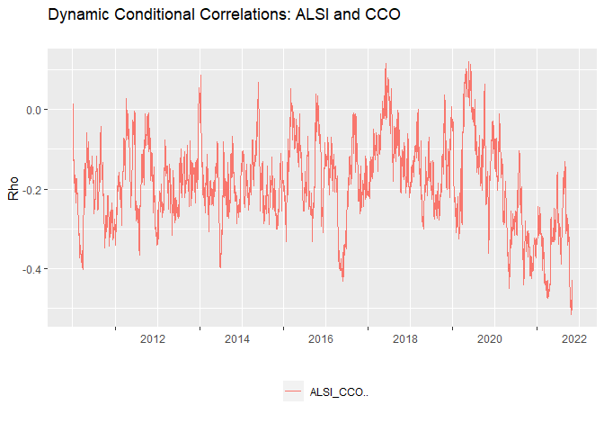

# Setting up

I begin my project by cleaning my environment and loading the necessary
functions to be used in order to

I make use of the ‘Texevier’ package to create the project

I then load the packages to used in this analysis. I make use of the
‘tidyverse’ to clean and wrangle the data as well as perform
visualization.

# Import the data

I read in the Alsi_Returns data and remove the words ‘SJ’ and ‘Equity’
from Tickers column to neaten up the data. Next, I view that data noting
the characteristics of the data such a date range and the various
columns of information.

I do notice that there are Tickers with missing values and some that
have not been included in the ALSI as they have zero weights.

I log the data before performing imputing the missing values in the data
set as I anticipate that it will result in NA/NaN/-Inf. The
‘impute_missing_values’ function can address Nas and Nan, so I will set
Returns with -Inf to zero.

Next, I source in all the functions to be used to conduct the analysis.

## Data Insights

I make use of the dplyr package to determine how many unique sectors are
in the data set and to determine how many unique property stocks or
REITS are included in the data set and if they change over time, by
arbitrarily entering dates within the data’s range.

If find that from 2005 to 2022, the number of REITS changes over time.
My next step is therefore to plot the data where each property ticker is
plotted in it’s own panel. To do this I make use of ‘facet_wrap’ in the
package ‘ggplot2’

I make use of the tidyverse package in to wrangle the data into a usable
format to conduct the analysis. The task here is to remove the property
stocks from the Alsi_Returns data, so I can calculate the daily returns
for the ALSI less REITs. Once I have the daily weighted performance of
the AlSI less REITS I will combine these daily returns with the daily
returns data of the REITs. This is done so a comparison of individual
property stocks can be drawn with the ALSI equities.

Missing values poses a small problem to deal with, however, it won’t be
as simple as imputing all the values for the complete ALSI. The reason
being is that there appears to be many missing values, some
Tickers/equities did not exist on the JSE at the point of measurement or
were not included in the ALSI, to impute values for all equities in the
index, normal and REITs, would give the REIT observations properties of
the other equities and vice versa and, lastly, across time the number of
REITs included in the index changes and there are many instances of
REITs moving in and out of the index.

One cannot impute missing values for the entire data set together,
especially given that the purpose of this study is to examine the
correlation of property stocks with rest of the ALSI. The approach I am
taking is to separate the property stocks from the rest of the ALSI as
discussed and then plot out the all the property stocks across time in
the data set and determine which have sufficiently complete returns
observations that I may impute accurate values that have a similar
distributions, so to capture the properties of these property stocks
(given that the theory surrounding REITs is that should be uncorrelated
to other equities. Once, I have determined which REITS to include I will
impute the missing for rest of the ALSI index and then combine the data
to begin the DCC or mGARCH model.

# Seperate and plot the REITs data

``` r
library(tidyverse)

# add individual property stock and their weighted returns to perform DCC
property_returns <- data_ALSI_returns %>%
        filter(Sector == "Property") %>%
        select(date, Tickers, Return, J433, Sector) %>%
        na.omit(J433) %>% # remove observations that don't have weights i.e. NA
        arrange(date, Tickers) %>%
        select(date, Tickers, Return)


graph_1 <- graph_1_reit_funcs(df_data = property_returns,
                title = "JSE listed REITs over time ",
                subtitle = "",
                caption = "Note how many REITs have complete data sets",
                xlabel = "",
                ylabel = "")

graph_1
```


From the graph above one can see that can see that there are only a few
listed REITs that have a sufficient number of observations to offer
insight into the correlation between between REITs and the rest of the
ALSI.

I then proceed to select the following Tickers to include in the study.
REITs to include: CCO, EMI, GRT, HYP, RDF, RES, SAC.

Next, I filter the ALSI Property data for the REITs listed above and
impute the missing values in this filtered data.

# Impute missing values: Property equities

``` r
#
data_alsi_REIT <- data_alsi %>%
        filter(Sector == "Property") %>%
        select(date, Tickers, Return) %>%
        spread(Tickers, Return)

# select the columns that correspond to the following REITs equities.
# REITs to include: CCO, EMI, GRT, HYP, RDF, RES, SAC
data_alsi_REIT_red<- data_alsi_REIT[, c(1,14,19,26,30,45,47,52)]
# Remember to include the date column
# the dplyr func 'filter' nor the 'select' (once spread) did not work
# the therfore diverted to base R to filter for the REITs that had data for decade

# make tidy format once again
data_alsi_REIT_reduced <- data_alsi_REIT_red %>% 
                            gather(Tickers, Return, -date)

# Now impute missing values using the 'impute_missing_values' function
imputed_REIT_returns_spread <- impute_missing_returns(
    
    return_mat = data_alsi_REIT_reduced %>%
        select(date, Tickers, Return) %>%
        spread(Tickers, Return),
        
    impute_returns_method = "Drawn_Distribution_Own")
```

# graph the performance of the REITS

# Impute missing values: ALSI less REITs

``` r
# create a data set where property stocks have been removed from the Alsi_Returns data and re-weighted.
# Now impute missing values using the 'impute_missing_values' function

imputed_ALSI_returns_spread <- impute_missing_returns(
    
    return_mat = data_alsi %>% 
        filter(Sector != "Property") %>%
        select(date, Tickers, Return) %>% 
        #na.omit(J433) %>% # remove observations that don't have weights i.e. NA
        arrange(date) %>% 
        #mutate(weights = J433/sum(J433)) %>%
        #mutate(weighted_return = Return * weights) %>% # re-weight ALSI less property stocks
        #group_by(date) %>% 
        #mutate(Return = sum(weighted_return)) %>% 
        #distinct(., date, .keep_all = T) %>% 
        #mutate(Tickers = "ALSI") %>% 
        select(date, Tickers, Return) %>% 
        spread(Tickers, Return),
        
    impute_returns_method = "Drawn_Distribution_Collective")
```

# Combine the data

I now use the imputed data for the ALSI less REITs and make it tidy by
placing the data into 3 columns (date, Tickers, Return). Next wrangle
the data to calculate average daily returns of the ALSI less REITs.

I now want to bind the rows of the weighted returns of the ALSI with the
individual property stocks that had previously been removed separated to
impute the missing values. This will allow for correlation comparisons
with individual property stocks with the broader performance with the
ALSI equities for the other sectors.

The data wrangling described above is nested in the function
‘mv_garch_COMBINED_nested_function(df_data)’ for the estimated
volatility.

# DCC Model multivariate GARCH model (Time varying correlation)

I follow the practical code closely to render the model. I amend code
and nested functions inside one another to keep the working document
neat. I plot the estimates of volatility for each seriesfrom ‘dccPre’.

``` r
# use dccPre to fit the univariate GARCH models to each series in the data frame of returns.
# Let's select a VAR order of zero for the mean equation, and use the mean of each series.

# Then, for every series, a standard univariate GARCH(1,1) is run - giving us:
# et and sigmat, which is then used to calculate the standardized resids, zt.
# zt is used in DCC calcs after.

# SEE: q6_nested_graph_function.R (NESTED FUNC)
mv_garch_COMBINED_nested_function(df_data)
```

    ## Sample mean of the returns:  -0.3994083 -0.8001421 0.7963037 -0.1924919 0.8464523 0.05504507 -0.1252145 0.2183139 
    ## Component:  1 
    ## Estimates:  1.329662 0.041973 0 
    ## se.coef  :  0.686947 0.019389 0.498869 
    ## t-value  :  1.935612 2.164712 0 
    ## Component:  2 
    ## Estimates:  0.137567 0 0.887703 
    ## se.coef  :  0.290326 0.015089 0.224897 
    ## t-value  :  0.473835 1e-06 3.947145 
    ## Component:  3 
    ## Estimates:  0.22747 0 0.849408 
    ## se.coef  :  0.377264 0.009069 0.252319 
    ## t-value  :  0.602947 1e-06 3.366407 
    ## Component:  4 
    ## Estimates:  0.018863 0.009219 0.979289 
    ## se.coef  :  0.006225 0.002767 0.00413 
    ## t-value  :  3.030333 3.331662 237.1047 
    ## Component:  5 
    ## Estimates:  0.100229 0.004739 0.912629 
    ## se.coef  :  0.089448 0.007403 0.075438 
    ## t-value  :  1.120522 0.640092 12.09778 
    ## Component:  6 
    ## Estimates:  0.00256 0.0025 0.995881 
    ## se.coef  :  0.000865 0.000562 0.000197 
    ## t-value  :  2.959469 4.445303 5057.163 
    ## Component:  7 
    ## Estimates:  0.004121 0.007067 0.987339 
    ## se.coef  :  0.001707 0.002239 0.001695 
    ## t-value  :  2.41464 3.156464 582.4922 
    ## Component:  8 
    ## Estimates:  0.000263 0.019112 0.950509 
    ## se.coef  :  0.000116 0.005987 0.016859 
    ## t-value  :  2.261129 3.192375 56.3808


Additionally, I plot the volatility of only the seven REIT equities
included in this study.

``` r
# volatility of REITs
mv_garch_REIT_nested_function(df_data)
```

    ## Sample mean of the returns:  -0.3658912 -0.766625 0.8298208 -0.1589748 0.8799694 0.08856218 -0.09169734 
    ## Component:  1 
    ## Estimates:  1.329662 0.041973 0 
    ## se.coef  :  0.686947 0.019389 0.498869 
    ## t-value  :  1.935612 2.164712 0 
    ## Component:  2 
    ## Estimates:  0.137567 0 0.887703 
    ## se.coef  :  0.290326 0.015089 0.224897 
    ## t-value  :  0.473835 1e-06 3.947145 
    ## Component:  3 
    ## Estimates:  0.22747 0 0.849408 
    ## se.coef  :  0.377264 0.009069 0.252319 
    ## t-value  :  0.602947 1e-06 3.366407 
    ## Component:  4 
    ## Estimates:  0.018863 0.009219 0.979289 
    ## se.coef  :  0.006225 0.002767 0.00413 
    ## t-value  :  3.030333 3.331662 237.1047 
    ## Component:  5 
    ## Estimates:  0.100229 0.004739 0.912629 
    ## se.coef  :  0.089448 0.007403 0.075438 
    ## t-value  :  1.120522 0.640092 12.09778 
    ## Component:  6 
    ## Estimates:  0.00256 0.0025 0.995881 
    ## se.coef  :  0.000865 0.000562 0.000197 
    ## t-value  :  2.959469 4.445303 5057.163 
    ## Component:  7 
    ## Estimates:  0.004121 0.007067 0.987339 
    ## se.coef  :  0.001707 0.002239 0.001695 
    ## t-value  :  2.414641 3.156474 582.4899


The ‘dccPre’ function is use to fit the univariate GARCH models to each
series in the data and a standard univariate GARCH(1,1) is run which
produces the error term and sigma, which is then used to calculate the
standardized residuals used in estimate the DCC model.

The DCC model is then run and the estimates of time-varying correlation
are produced.

# CORR GRAPHS: Co-movements

The ‘dccPre’ function is use to fit the univariate GARCH models to each
series in the data and a standard univariate GARCH(1,1) is run which
produces the error term and sigma, which is then used to calculate the
standardized residuals used in estimate the DCC model.

``` r
# Use the cleaning func to warngle data and get into 'xts' format
xts_ALSI_data_combined_use <- data_cleaning_func(df_data)
```

The DCC model is then run and the estimates of time-varying correlation
are produced.

``` r
DCCPre <- dccPre(xts_ALSI_data_combined_use, include.mean = F, p = 0)
```

    ## Component:  1 
    ## Estimates:  0.002871 0 0.998131 
    ## se.coef  :  2.4e-05 NaN NaN 
    ## t-value  :  118.9039 NaN NaN 
    ## Component:  2 
    ## Estimates:  0.036256 0.008604 0.971951 
    ## se.coef  :  0.015539 0.003616 0.009043 
    ## t-value  :  2.333277 2.379088 107.4866 
    ## Component:  3 
    ## Estimates:  0.063313 0.009501 0.961024 
    ## se.coef  :  0.033034 0.005641 0.016404 
    ## t-value  :  1.916623 1.684276 58.58321 
    ## Component:  4 
    ## Estimates:  0.011613 0.008935 0.984134 
    ## se.coef  :  0.003782 0.002065 0.002507 
    ## t-value  :  3.070848 4.326704 392.5075 
    ## Component:  5 
    ## Estimates:  0.015572 0.011433 0.980533 
    ## se.coef  :  0.008004 0.003079 0.004566 
    ## t-value  :  1.945484 3.712729 214.725 
    ## Component:  6 
    ## Estimates:  0.001926 0.001927 0.996842 
    ## se.coef  :  0.000518 0.000343 0.000122 
    ## t-value  :  3.71455 5.625547 8143.642 
    ## Component:  7 
    ## Estimates:  0.003888 0.007996 0.986828 
    ## se.coef  :  0.001593 0.002071 0.001801 
    ## t-value  :  2.440491 3.860301 548.0592 
    ## Component:  8 
    ## Estimates:  0.000333 0.033299 0.96085 
    ## se.coef  :  0.000254 0.008646 0.010716 
    ## t-value  :  1.309387 3.851229 89.66801

``` r
# After saving now the standardized residuals:
StdRes <- DCCPre$sresi
# We can now use these sresids to calculate the DCC model.
# In order to fit the DCC model detach the tidyr and dplyr packages, 
# once detached can now run dccFit
# when done then tidyr and dplyr 
detach("package:tidyverse", unload=TRUE)
detach("package:tbl2xts", unload=TRUE)
DCC <- dccFit(StdRes, type="Engle")
```

    ## Estimates:  0.95 0.03345756 20 
    ## st.errors:  NaN NaN 1.137283 
    ## t-values:   NaN NaN 17.58577

``` r
pacman::p_load("tidyverse", "rmsfuns", "fmxdat", "tbl2xts", "broom")
```

``` r
graph_rename_func_mv(input_name_1 = "ALSI_",
                     input_name_2 = "_ALSI",
                     title = "Dynamic Conditional Correlations: ALSI",
                     subtitle = "",
                     caption = "",
                     xlabel = "",
                     ylabel = "Rho")
```


## Graph: ALSI with Individual REITS

``` r
graph_rename_func_mv(input_name_1 = "ALSI_CCO",
                     input_name_2 = "_ALSI",
                     title = "Dynamic Conditional Correlations: ALSI and CCO",
                     subtitle = "",
                     caption = "",
                     xlabel = "",
                     ylabel = "Rho")
```



``` r
graph_rename_func_mv(input_name_1 = "ALSI_EMI",
                     input_name_2 = "_ALSI",
                     title = "Dynamic Conditional Correlations: ALSI and EMI",
                     subtitle = "",
                     caption = "",
                     xlabel = "",
                     ylabel = "Rho")
```


``` r
graph_rename_func_mv(input_name_1 = "ALSI_GRT",
                     input_name_2 = "_ALSI",
                     title = "Dynamic Conditional Correlations: ALSI and GRT",
                     subtitle = "",
                     caption = "",
                     xlabel = "",
                     ylabel = "Rho")
```


``` r
graph_rename_func_mv(input_name_1 = "ALSI_HYP",
                     input_name_2 = "_ALSI",
                     title = "Dynamic Conditional Correlations: ALSI and HYP",
                     subtitle = "",
                     caption = "",
                     xlabel = "",
                     ylabel = "Rho")
```


``` r
graph_rename_func_mv(input_name_1 = "ALSI_RES",
                     input_name_2 = "_ALSI",
                     title = "Dynamic Conditional Correlations: ALSI and RES",
                     subtitle = "",
                     caption = "",
                     xlabel = "",
                     ylabel = "Rho")
```


``` r
graph_rename_func_mv(input_name_1 = "ALSI_RDF",
                     input_name_2 = "_ALSI",
                     title = "Dynamic Conditional Correlations: ALSI and RDF",
                     subtitle = "",
                     caption = "",
                     xlabel = "",
                     ylabel = "Rho")
```


``` r
graph_rename_func_mv(input_name_1 = "ALSI_SAC",
                     input_name_2 = "_ALSI",
                     title = "Dynamic Conditional Correlations: ALSI and SAC",
                     subtitle = "",
                     caption = "",
                     xlabel = "",
                     ylabel = "Rho")
```


## Graph: CCO with Individual REITS

``` r
graph_rename_func_mv(input_name_1 = "CCO.._",
                     input_name_2 = "CCO.._ALSI",
                     title = "Dynamic Conditional Correlations: ALSI and RDF",
                     subtitle = "",
                     caption = "",
                     xlabel = "",
                     ylabel = "Rho")
```


