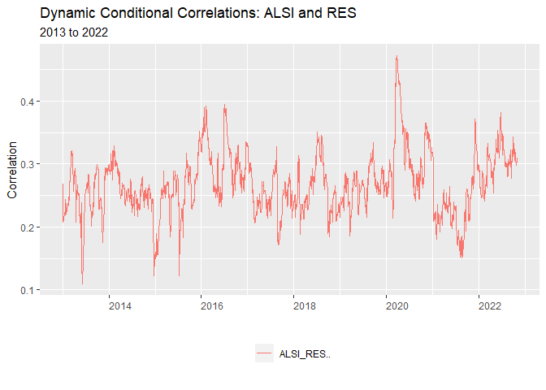

# Time-varying Correlation of South African Property Stocks and the JSE All Share Weighted Index

# Setting up

I begin my project by cleaning my environment and loading the necessary
functions to be used in order to

I make use of the ‘Texevier’ package to create the project

    Texevier::create_template(
        directory = "C:/Masters Economics/Fin Metrics/Fin_Metrics_Project",
                template_name = "Fin_Metrics_Project", build_project = TRUE, open_project = FALSE)

I then load the packages to used in this analysis. I make use of the
‘tidyverse’ to clean and wrangle the data as well as perform
visualization.

    # load pacakges to be used in the analysis
    pacman::p_load("tidyverse", "devtools", "rugarch", "rmgarch", 
        "forecast", "tbl2xts", "lubridate", "PerformanceAnalytics", 
        "ggthemes", "ks", "MTS", "robustbase", "tbl2xts")

# Import the data

I read in the Alsi\_Returns data and remove the words ‘SJ’ and ‘Equity’
from Tickers column to neaten up the data. Next, I view that data noting
the characteristics of the data such a date range and the various
columns of information.

I do notice that there are Tickers with missing values and some that
have not been included in the ALSI as they have zero weights.

Next, I source in all the functions built to be used to conduct the
analysis.

    # read in the data
    data_ALSI_returns <- read_rds("data/Alsi_Returns.rds") %>% 
            select(date, Tickers, Return, Sector, J203, Market.Cap) %>% 
            arrange(date, Tickers)
    # Remove the 'SJ' and 'Equity' from Tickers
    data_ALSI_returns$Tickers <- gsub("SJ|Equity", "", data_ALSI_returns$Tickers)
    # there are many NAs/NaNs that could pose a problem

    # source in fuctions
    list.files('code/', full.names = T, recursive = T) %>% .[grepl('.R', .)] %>% as.list() %>% walk(~source(.))

## Data Insights

I make use of the dplyr package to determine how many unique sectors are
in the data set and to determine how many unique property stocks or
REITS are included in the data set and if they change over time, by
arbitrarily entering dates within the data’s range.

If find that from 2005 to 2022, the number of REITS changes over time.
My next step is therefore to plot the data where each property ticker is
plotted in it’s own panel. To do this I make use of ‘facet\_wrap’ in the
package ‘ggplot2’

    # determine which sectors are included in the data set
    data_ALSI_returns %>% 
        select(Sector) %>%
        unique()

    # input any date with in the data range to determine how many unique property stocks there are and if this changes over time
    data_ALSI_returns %>% filter(date == "2013-02-03") %>%
        filter(Sector == "Property") %>%
        arrange(date, Tickers) %>% 
        group_by(Tickers) %>%
        select(date, Tickers) %>% 
        unique()

    # count the number of NAs or missing values in the data
    data_ALSI_returns %>% 
        select(date, Tickers, Return, J203) %>% 
        group_by(Tickers) %>%
        select(date, Tickers) %>% 
        unique()
        
    # some wrangling to determine if the J203 sums to 1 for an arbitrary date
    # can set date to any week date
    # there for can make use of na.omit or set NAs to zero for the weights column 'J203'
    # Which is tested below
    data_ALSI_returns %>% filter(date == "2012-02-03") %>% 
        select(date, Tickers, Return, J203, Sector) %>% 
        na.omit(J203) %>% 
        mutate(sum(J203)) 

I make use of the tidyverse package in to wrangle the data into a usable
format to conduct the analysis. The task here is to remove the property
stocks from the Alsi\_Returns data, so I can calculate the daily returns
for the ALSI less REITs. Once I have the daily weighted performance of
the AlSI less REITS I will combine these daily returns with the daily
returns data of the REITs. This is done so a comparison of individual
property stocks can be drawn with the ALSI equities.

Across time the number of REITs included in the index changes and there
are many instances of REITs moving in and out of the index.

# Seperate and plot the REITs data

The approach I am taking is to separate the property stocks from the
rest of the ALSI as discussed and then plot out the all the property
stocks across time in the data set and determine which have sufficiently
complete returns observations and this information to be used later to
select for a sub-sample of REITs. To achiev this format ‘facet wrap’ is
used do detach each series from one another.

    library(tidyverse)

    # add individual property stock and their weighted returns to perform DCC
    graph_1_reit_funcs(df_data = df_data,
                    title = "JSE listed REITs over time ",
                    subtitle = "",
                    caption = "Note how many REITs have complete data sets",
                    xlabel = "",
                    ylabel = "")

From the graph above one can see that can see that there are only a few
listed REITs that have a sufficient number of observations to offer
insight into the correlation between between REITs and the rest of the
ALSI.

# Cumulative Returns over time

I wrangle THE ALSI returns to create a column of total weighted returns
per day for the ALSI excl. REITs and REITs filtering for observation by
sector. Next cumulative returns are calculated before the data is
wrapped in a graphing function.

    graph_cum_return_func(df_data = data_ALSI_returns,
                          title = "Cumulative Returns of ALSI",
                          subtitle = "From 2005 to 2022",
                          caption = "REITS vs ALSI excl. REITS",
                          xlabel = "Date",
                          ylabel = "Cumulative Return")

The graphing function below makes use of the same technique as above,
however this process of calculating total daily weighted returns and
cumulative returns is performed for each sector in the data. Lastly, I
wrap these opertions inside a graphing function.

Sectors: Industrials, Financials, Property and Resources.

    library(tidyverse)

    # ALSI and REIT, cumulative return

    sector_graph_cum_return_func(df_data = data_ALSI_returns,
                          title = "Cumulative Returns of ALSI by Sector",
                          subtitle = "From 2005 to 2022",
                          caption = "",
                          xlabel = "Date",
                          ylabel = "Cumulative Return")

# DCC Model multivariate GARCH model (Time varying correlation)

I follow the practical code closely to render the model. I amend code
and nested functions inside one another to keep the working document
neat. I plot the estimates of volatility for each series from ‘dccPre’.

A topdown a approach is made use of here to conduct the analysis.

    # use dccPre to fit the univariate GARCH models to each series in the data frame of returns.
    # Let's select a VAR order of zero for the mean equation, and use the mean of each series.

    # Then, for every series, a standard univariate GARCH(1,1) is run - giving us:
    # et and sigmat, which is then used to calculate the standardized resids, zt.
    # zt is used in DCC calcs after.

    # SEE: q6_nested_graph_function.R (NESTED FUNC)
    # result
    Vol_ALSI_REIT <- compare_vol_mv_garch_func(df_data)

    ## Sample mean of the returns:  0.000582957 0.0004614094 
    ## Component:  1 
    ## Estimates:  2e-06 0.094008 0.890164 
    ## se.coef  :  0 0.008922 0.010187 
    ## t-value  :  4.971216 10.5361 87.37819 
    ## Component:  2 
    ## Estimates:  3e-06 0.143369 0.835426 
    ## se.coef  :  0 0.012403 0.012595 
    ## t-value  :  6.922558 11.55944 66.33011

I plot the noise reduce volatility of JSE listed ALSI and REIT equities
included in this study. This procedure is wrapped in the above function
and follows the same procedure using the ‘dcc’ package as done below.

    # volatility of REITs
    mv_garch_COMBINED_nested_function(Vol_ALSI_REIT)

# Correlation Graphs: Co-movements

The ‘dccPre’ function is use to fit the univariate GARCH models to each
series in the data and a standard univariate GARCH(1,1) is run which
produces the error term and sigma, which is then used to calculate the
standardized residuals used to estimate correlation coefficients using
the DCC model.

Packages that interfere with the ‘dcc’ package are removed before
fitting the model and are added again after.

The DCC model is then run and the estimates of time-varying correlation
are fitted.

This procedure is run repeatedily changing the input data each so to add
to the depth of then analysis.

    ################################################################################
    # Sum ALSI vs Sum REITs
    ################################################################################

    # Use the cleaning func to warngle data and get into 'xts' format
    xts_ALSI_data_combined_use <- data_cleaning_func(df_data)

    DCCPre <- dccPre(xts_ALSI_data_combined_use, include.mean = T, p = 0)

    ## Sample mean of the returns:  0.000582957 0.0004614094 
    ## Component:  1 
    ## Estimates:  2e-06 0.094008 0.890164 
    ## se.coef  :  0 0.008922 0.010187 
    ## t-value  :  4.971216 10.5361 87.37819 
    ## Component:  2 
    ## Estimates:  3e-06 0.143369 0.835426 
    ## se.coef  :  0 0.012403 0.012595 
    ## t-value  :  6.922558 11.55944 66.33011

    # After saving now the standardized residuals:
    StdRes <- DCCPre$sresi
    # We can now use these std. resids to calculate the DCC model.
    # In order to fit the DCC model detach the tidyr and dplyr packages, 
    # once detached can now run dccFit
    # when done then tidyr and dplyr 
    detach("package:tidyverse", unload=TRUE)
    detach("package:tbl2xts", unload=TRUE)
    DCC <- dccFit(StdRes, type="Engle")

    ## Estimates:  0.95 0.02503006 8.020321 
    ## st.errors:  0.01463392 0.005825223 0.5337312 
    ## t-values:   64.91768 4.296841 15.02689

    pacman::p_load("tidyverse", "tbl2xts", "broom")

The model on returns data from the JSE FTSE All Share Index generates
time-varying conditional correlation estimates that I plot making use of
some code from class practicals. The code calculates the bivariate
correlation between all the pairs in our data set and then plots them.

input\_name\_1: pair to be included input\_name\_1: pair not to be
included

    graph_rename_func_mv(input_name_1 = "ALSI_",
                         input_name_2 = "_ALSI",
                         title = "Dynamic Conditional Correlations: JSE ALSI and REITS",
                         subtitle = "2005 to 2022",
                         caption = "",
                         xlabel = "",
                         ylabel = "Rho")

This process is repeated for returns data where weighted total daily
returns have been calculate for each sector and then the conditional
correlations are estimated using the same method as above. The results
are then plotted below.

    # DCC GARCH model

    ################################################################################
    # ALSI Correlation by Sector
    ################################################################################

    # Use the cleaning func to warngle data and get into 'xts' format
    xts_ALSI_data_combined_use <- sector_data_cleaning_func(df_data)

    DCCPre <- dccPre(xts_ALSI_data_combined_use, include.mean = T, p = 0)

    ## Sample mean of the returns:  0.0006486978 0.0004614094 0.0005219509 0.0006269435 
    ## Component:  1 
    ## Estimates:  3e-06 0.064242 0.924782 
    ## se.coef  :  1e-06 0.006382 0.007413 
    ## t-value  :  4.353249 10.06543 124.7438 
    ## Component:  2 
    ## Estimates:  3e-06 0.143369 0.835426 
    ## se.coef  :  0 0.012403 0.012595 
    ## t-value  :  6.922558 11.55944 66.33011 
    ## Component:  3 
    ## Estimates:  4e-06 0.105609 0.877805 
    ## se.coef  :  1e-06 0.009568 0.010871 
    ## t-value  :  5.116441 11.03752 80.74382 
    ## Component:  4 
    ## Estimates:  3e-06 0.099157 0.882423 
    ## se.coef  :  0 0.009287 0.010707 
    ## t-value  :  5.289404 10.67644 82.41168

    # After saving now the standardized residuals:
    StdRes <- DCCPre$sresi
    # We can now use these sresids to calculate the DCC model.
    # In order to fit the DCC model detach the tidyr and dplyr packages, 
    # once detached can now run dccFit
    # when done then tidyr and dplyr 
    detach("package:tidyverse", unload=TRUE)
    detach("package:tbl2xts", unload=TRUE)
    DCC <- dccFit(StdRes, type="Engle")

    ## Estimates:  0.95 0.03267037 9.070108 
    ## st.errors:  0.005898765 0.003104605 0.4529528 
    ## t-values:   161.0507 10.5232 20.0244

    pacman::p_load("tidyverse", "tbl2xts", "broom")

    graph_rename_func_mv(input_name_1 = "Property_",
                         input_name_2 = "_Property",
                         title = "Dynamic Conditional Correlations: JSE ALSI by Sector",
                         subtitle = "2005 to 2022",
                         caption = "",
                         xlabel = "",
                         ylabel = "Rho")

# Individual REITs

I then proceed to select the following Tickers to include in the study
that have data available since the REITs legislation came into affect.

REITs to include: GRT, HYP, RDF, RES, SAC, VKE.

Following the same procedure estimates are estimated, fitted and then
graphed.

    ################################################################################
    # Sum ALSI vs Individual REITs
    ################################################################################

    # Use the cleaning func to warngle data and get into 'xts' format
    xts_ALSI_data_combined_use <- data_cleaning_func_indi_REIT(df_data)

    DCCPre <- dccPre(xts_ALSI_data_combined_use, include.mean = T, p = 0)

    ## Sample mean of the returns:  0.0004235497 4.674865e-05 1.950086e-05 1.749393e-05 3.245661e-05 1.208517e-05 1.079732e-05 
    ## Component:  1 
    ## Estimates:  3e-06 0.091276 0.884977 
    ## se.coef  :  1e-06 0.012946 0.01679 
    ## t-value  :  3.541437 7.050301 52.70934 
    ## Component:  2 
    ## Estimates:  0 0.121294 0.857423 
    ## se.coef  :  0 0.015272 0.016986 
    ## t-value  :  4.625104 7.942116 50.47732 
    ## Component:  3 
    ## Estimates:  0 0.135562 0.829398 
    ## se.coef  :  0 0.018074 0.020953 
    ## t-value  :  5.005064 7.500297 39.58377 
    ## Component:  4 
    ## Estimates:  0 0.104502 0.876085 
    ## se.coef  :  0 0.013245 0.015453 
    ## t-value  :  4.147583 7.890113 56.69196 
    ## Component:  5 
    ## Estimates:  0 0.121697 0.868939 
    ## se.coef  :  0 0.012451 0.011981 
    ## t-value  :  4.769893 9.774229 72.5268 
    ## Component:  6 
    ## Estimates:  0 0.107955 0.876044 
    ## se.coef  :  0 0.011632 0.012319 
    ## t-value  :  4.590888 9.280462 71.11215 
    ## Component:  7 
    ## Estimates:  0 0.10624 0.883638 
    ## se.coef  :  0 0.013861 0.014489 
    ## t-value  :  3.892706 7.664749 60.98581

    # After saving now the standardized residuals:
    StdRes <- DCCPre$sresi
    # We can now use these sresids to calculate the DCC model.
    # In order to fit the DCC model detach the tidyr and dplyr packages, 
    # once detached can now run dccFit
    # when done then tidyr and dplyr 
    detach("package:tidyverse", unload=TRUE)
    detach("package:tbl2xts", unload=TRUE)
    DCC <- dccFit(StdRes, type="Engle")

    ## Estimates:  0.9451738 0.01240002 8.112577 
    ## st.errors:  0.01618379 0.002500119 0.3618433 
    ## t-values:   58.4025 4.959773 22.42014

    pacman::p_load("tidyverse", "tbl2xts", "broom")

    graph_rename_func_mv(input_name_1 = "ALSI",
                         input_name_2 = "_ALSI",
                         title = "Dynamic Conditional Correlations: JSE ALSI and Individual REITS",
                         subtitle = "2013 to 2022",
                         caption = "",
                         xlabel = "",
                         ylabel = "Rho")

For the display of time-varying correlation of individual REITs with the
ALSI, I plot each pair individually by changing the input name. Also,
the formatting of this chunk is changed to accommodate the 6 graphs
plotted together by reducing the size of the plots to 50%.

    graph_rename_func_mv(input_name_1 = "ALSI_GRT",
                         input_name_2 = "_ALSI",
                         title = "Dynamic Conditional Correlations: ALSI and GRT",
                         subtitle = "2013 to 2022",
                         caption = "",
                         xlabel = "",
                         ylabel = "Correlation")

    graph_rename_func_mv(input_name_1 = "ALSI_HYP",
                         input_name_2 = "_ALSI",
                         title = "Dynamic Conditional Correlations: ALSI and HYP",
                         subtitle = "2013 to 2022",
                         caption = "",
                         xlabel = "",
                         ylabel = "Correlation")

    graph_rename_func_mv(input_name_1 = "ALSI_RES",
                         input_name_2 = "_ALSI",
                         title = "Dynamic Conditional Correlations: ALSI and RES",
                         subtitle = "2013 to 2022",
                         caption = "",
                         xlabel = "",
                         ylabel = "Correlation")

    graph_rename_func_mv(input_name_1 = "ALSI_RDF",
                         input_name_2 = "_ALSI",
                         title = "Dynamic Conditional Correlations: ALSI and RDF",
                         subtitle = "2013 to 2022",
                         caption = "",
                         xlabel = "",
                         ylabel = "Correlation")

    graph_rename_func_mv(input_name_1 = "ALSI_SAC",
                         input_name_2 = "_ALSI",
                         title = "Dynamic Conditional Correlations: ALSI and SAC",
                         subtitle = "2013 to 2022",
                         caption = "",
                         xlabel = "",
                         ylabel = "Correlation")

    graph_rename_func_mv(input_name_1 = "ALSI_VKE",
                         input_name_2 = "_ALSI",
                         title = "Dynamic Conditional Correlations: ALSI and SAC",
                         subtitle = "2013 to 2022",
                         caption = "",
                         xlabel = "",
                         ylabel = "Correlation")

# Periods of Rand Volatility

In this section, periods of high and low USD/ZAR (Dollar Rand)
volatility are isolated and used as to filter for the ALSI data. The
premise being that periods of high Rand volatility can act as an
indicator for high levels of volatility in South Africa financial
markets and other asset classes. These highly volatile periods are then
used as an index to filter the returns data for periods where South
African markets were volatile.

Given that the high volatility combine imputed ALSI returns data will
have large missing gaps due to periods of moderate or low volatility,
dynamic correlations between equity pairs will have to be charted for
short periods of a time. This is due to the fact that the graphing
function used will not skip whole year periods.

Following this methodology of running multiple DCC models on smaller
periods of high volatility decreases the run time of the model.

Here the same procedure is followed to generate co-movement graphs
however dates are filter for using the Rand volatility dates

    # Use the cleaning func to warngle data and get into 'xts' format
    xts_HI_Vol_ALSI_data_combined_ <- data_cleaning_func_hi_vol_2008_2022(df_data)

    #-------------------------------------------------------------------------------

    #The DCC model is then run and the estimates of time-varying correlation are produced.

    DCC_ <- dccPre(xts_HI_Vol_ALSI_data_combined_, include.mean = T, p = 0)

    ## Sample mean of the returns:  -5.803068e-05 -0.0003070326 
    ## Component:  1 
    ## Estimates:  1.2e-05 0.158702 0.811963 
    ## se.coef  :  4e-06 0.028388 0.028632 
    ## t-value  :  3.163277 5.590477 28.35861 
    ## Component:  2 
    ## Estimates:  1.4e-05 0.386498 0.629849 
    ## se.coef  :  4e-06 0.068918 0.048556 
    ## t-value  :  3.719094 5.608057 12.97161

    # After saving now the standardized residuals:
    StdRes_ <- DCC_$sresi
    # We can now use these sresids to calculate the DCC model.
    # In order to fit the DCC model detach the tidyr and dplyr packages,
    # once detached can now run dccFit
    # when done then tidyr and dplyr
    detach("package:tidyverse", unload=TRUE)
    detach("package:tbl2xts", unload=TRUE)
    DCC_ <- dccFit(StdRes_, type="Engle")

    ## Estimates:  0.7395365 0.03261871 6.551065 
    ## st.errors:  0.2671019 0.03256171 0.8039966 
    ## t-values:   2.768743 1.001751 8.148125

    pacman::p_load("tidyverse", "tbl2xts", "broom")

Again the same graphing convention is used.

    hi_vol_graph_rename_func_mv(input_name_1 = "ALSI_",
                                        input_name_2 = "_ALSI",
                                        title = "Dynamic Conditional Correlations: ALSI and REITs",
                                        subtitle = "Periods of High Rand Volatility, 2007 to 2022",
                                        caption = "",
                                        xlabel = "",
                                        ylabel = "Rho")

And this is performed for periods of low volatility as well. The only
thing that changes is the which sets of dates, for high or low vol, are
used to filter the ALSI data

    # Use the cleaning func to warngle data and get into 'xts' format
    xts_Low_Vol_ALSI_data_combined_ <- data_cleaning_func_Low_vol_2008_2022(df_data)

    #-------------------------------------------------------------------------------

    #The DCC model is then run and the estimates of time-varying correlation are produced.

    DCC_ <- dccPre(xts_Low_Vol_ALSI_data_combined_, include.mean = T, p = 0)

    ## Sample mean of the returns:  0.0008707546 0.0006300748 
    ## Component:  1 
    ## Estimates:  1e-05 0.116359 0.771263 
    ## se.coef  :  4e-06 0.037881 0.074422 
    ## t-value  :  2.223659 3.071685 10.36333 
    ## Component:  2 
    ## Estimates:  3e-06 0.160288 0.809421 
    ## se.coef  :  1e-06 0.036993 0.039233 
    ## t-value  :  2.839723 4.332887 20.6313

    # After saving now the standardized residuals:
    StdRes_ <- DCC_$sresi
    # We can now use these sresids to calculate the DCC model.
    # In order to fit the DCC model detach the tidyr and dplyr packages,
    # once detached can now run dccFit
    # when done then tidyr and dplyr
    detach("package:tidyverse", unload=TRUE)
    detach("package:tbl2xts", unload=TRUE)
    DCC_ <- dccFit(StdRes_, type="Engle")

    ## Estimates:  0.7566106 0.02805932 6.698113 
    ## st.errors:  0.2927896 0.02567968 0.8880226 
    ## t-values:   2.584145 1.092666 7.542728

    pacman::p_load("tidyverse", "tbl2xts", "broom")

    Low_vol_graph_rename_func_mv(input_name_1 = "ALSI_",
                                        input_name_2 = "_ALSI",
                                        title = "Dynamic Conditional Correlations: ALSI and REITs",
                                        subtitle = "Low Volatility, 2007 to 2022",
                                        caption = "",
                                        xlabel = "",
                                        ylabel = "Rho")

# CAPCO and RDF investigation.

I now perform the safe operations as perform by slight amending the code
and naming new functions to call out. Here the individual REITs CCO and
RDF are selected to analysis co-movements between REITs in different
countries using the same ‘dcc’ function.

    ################################################################################
    # Sum ALSI vs COO and RDF
    ################################################################################

    # Use the cleaning func to warngle data and get into 'xts' format
    xts_ALSI_data_combined_use <- data_cleaning_func_COO_RDF(df_data)

    DCCPre <- dccPre(xts_ALSI_data_combined_use, include.mean = T, p = 0)

    ## Sample mean of the returns:  0.000413801 -2.089139e-05 -5.548415e-05 
    ## Component:  1 
    ## Estimates:  1e-05 0.10904 0.825864 
    ## se.coef  :  3e-06 0.02515 0.041374 
    ## t-value  :  2.935589 4.335614 19.96109 
    ## Component:  2 
    ## Estimates:  0 0.064232 0.925969 
    ## se.coef  :  0 0.013177 0.016006 
    ## t-value  :  2.060676 4.874433 57.8512 
    ## Component:  3 
    ## Estimates:  0 0.125367 0.853158 
    ## se.coef  :  0 0.021801 0.023558 
    ## t-value  :  3.283605 5.750526 36.21482

    # After saving now the standardized residuals:
    StdRes <- DCCPre$sresi
    # We can now use these sresids to calculate the DCC model.
    # In order to fit the DCC model detach the tidyr and dplyr packages, 
    # once detached can now run dccFit
    # when done then tidyr and dplyr 
    detach("package:tidyverse", unload=TRUE)
    detach("package:tbl2xts", unload=TRUE)
    DCC <- dccFit(StdRes, type="Engle")

    ## Estimates:  0.95 0.01700413 7.169061 
    ## st.errors:  0.394297 0.0638191 0.6652286 
    ## t-values:   2.409351 0.2664427 10.77684

    pacman::p_load("tidyverse", "tbl2xts", "broom")

Results are then plotted below using a the same graphing function as
before compare results with the ALSI.

    graph_rename_func_mv(input_name_1 = "ALSI",
                         input_name_2 = "_ALSI",
                         title = "Dynamic Conditional Correlations: ALSI, CCO and RDF",
                         subtitle = "2018 to 2022",
                         caption = "",
                         xlabel = "",
                         ylabel = "Rho")

Here I change the input so to only plot the co-movements between COO and
RDF.

    graph_rename_func_mv(input_name_1 = "CCO.._RDF",
                         input_name_2 = "_CCO",
                         title = "Dynamic Conditional Correlations: CCO and RDF",
                         subtitle = "2018 to 2022",
                         caption = "",
                         xlabel = "",
                         ylabel = "Rho")

Using the same code to stratify the data for high and low Rand
volatility periods. I know can determine how changes in the Rand effect
these stocks on an individual level.

    ################################################################################
    # Sum ALSI vs COO and RDF
    ################################################################################

    # Use the cleaning func to warngle data and get into 'xts' format
    xts_ALSI_data_combined_use <- HI_VOL_data_cleaning_func_COO_RDF(df_data)

    DCCPre <- dccPre(xts_ALSI_data_combined_use, include.mean = T, p = 0)

    ## Sample mean of the returns:  0.0002883105 -4.92663e-05 -0.0002152717 
    ## Component:  1 
    ## Estimates:  1.5e-05 0.180766 0.784107 
    ## se.coef  :  9e-06 0.05478 0.056648 
    ## t-value  :  1.61825 3.299881 13.84175 
    ## Component:  2 
    ## Estimates:  0 0.140941 0.846334 
    ## se.coef  :  0 0.047555 0.043474 
    ## t-value  :  1.414182 2.963768 19.46761 
    ## Component:  3 
    ## Estimates:  0 0.325531 0.737188 
    ## se.coef  :  0 0.089424 0.050269 
    ## t-value  :  1.326958 3.640324 14.66498

    # After saving now the standardized residuals:
    StdRes <- DCCPre$sresi
    # We can now use these sresids to calculate the DCC model.
    # In order to fit the DCC model detach the tidyr and dplyr packages, 
    # once detached can now run dccFit
    # when done then tidyr and dplyr 
    detach("package:tidyverse", unload=TRUE)
    detach("package:tbl2xts", unload=TRUE)
    DCC <- dccFit(StdRes, type="Engle")

    ## Estimates:  0.9132474 0.02063827 7.124898 
    ## st.errors:  0.06150703 0.01702183 1.637632 
    ## t-values:   14.84785 1.212459 4.350732

    pacman::p_load("tidyverse", "tbl2xts", "broom")

    graph_rename_func_mv(input_name_1 = "CCO.._RDF",
                         input_name_2 = "_CCO",
                         title = "Dynamic Conditional Correlations: ALSI, CCO and RDF",
                         subtitle = "High Volatility, 2018 to 2022",
                         caption = "",
                         xlabel = "",
                         ylabel = "Rho")

Like with the first stratification the code is reused of periods of low
volatility as well.

    ################################################################################
    # Sum ALSI vs COO and RDF
    ################################################################################

    # Use the cleaning func to warngle data and get into 'xts' format
    xts_ALSI_data_combined_use <- LOW_VOL_data_cleaning_func_COO_RDF(df_data)

    DCCPre <- dccPre(xts_ALSI_data_combined_use, include.mean = T, p = 0)

    ## Sample mean of the returns:  0.0002268075 -1.483966e-06 0.0001572208 
    ## Component:  1 
    ## Estimates:  0 0 1 
    ## se.coef  :  2e-06 0.030238 0.021203 
    ## t-value  :  0.030889 0 47.16399 
    ## Component:  2 
    ## Estimates:  0 0.071708 0.811478 
    ## se.coef  :  0 0.05863 0.141883 
    ## t-value  :  1.066651 1.223064 5.719352 
    ## Component:  3 
    ## Estimates:  1e-06 0.09683 0.786296 
    ## se.coef  :  1e-06 0.082234 0.13628 
    ## t-value  :  1.23541 1.177502 5.769706

    # After saving now the standardized residuals:
    StdRes <- DCCPre$sresi
    # We can now use these sresids to calculate the DCC model.
    # In order to fit the DCC model detach the tidyr and dplyr packages, 
    # once detached can now run dccFit
    # when done then tidyr and dplyr 
    detach("package:tidyverse", unload=TRUE)
    detach("package:tbl2xts", unload=TRUE)
    DCC <- dccFit(StdRes, type="Engle")

    ## Estimates:  0.8783672 0.049999 6.156317 
    ## st.errors:  0.0952908 0.03569148 1.402335 
    ## t-values:   9.217754 1.400866 4.390048

    pacman::p_load("tidyverse", "tbl2xts", "broom")

Again, the same graphing function using ggplot is used for these
results.

    graph_rename_func_mv(input_name_1 = "CCO.._RDF",
                         input_name_2 = "_CCO",
                         title = "Dynamic Conditional Correlations: ALSI, CCO and RDF",
                         subtitle = "Low Volatility, 2018 to 2022",
                         caption = "",
                         xlabel = "",
                         ylabel = "Rho")

